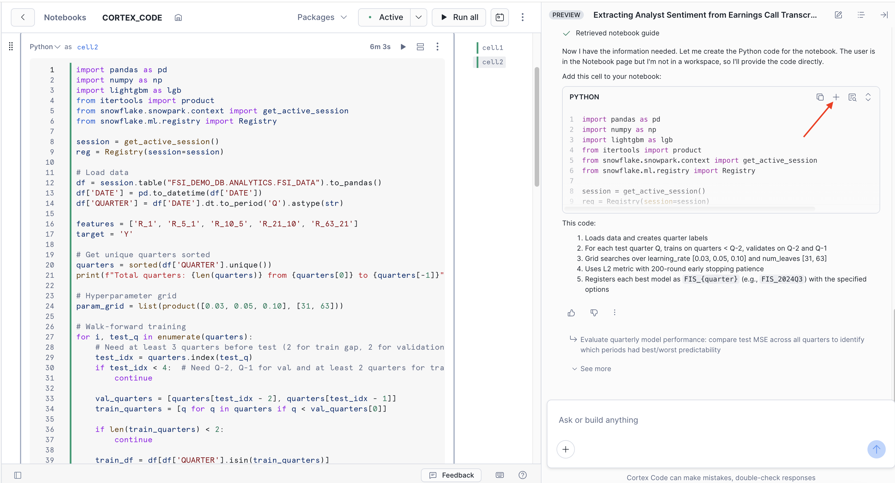
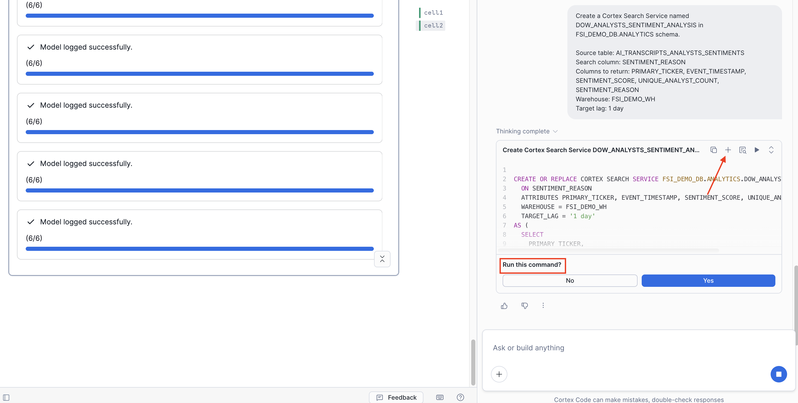
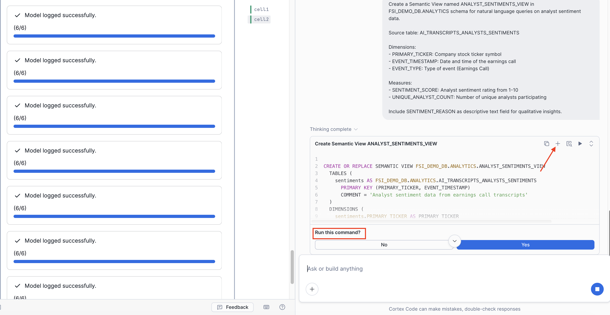
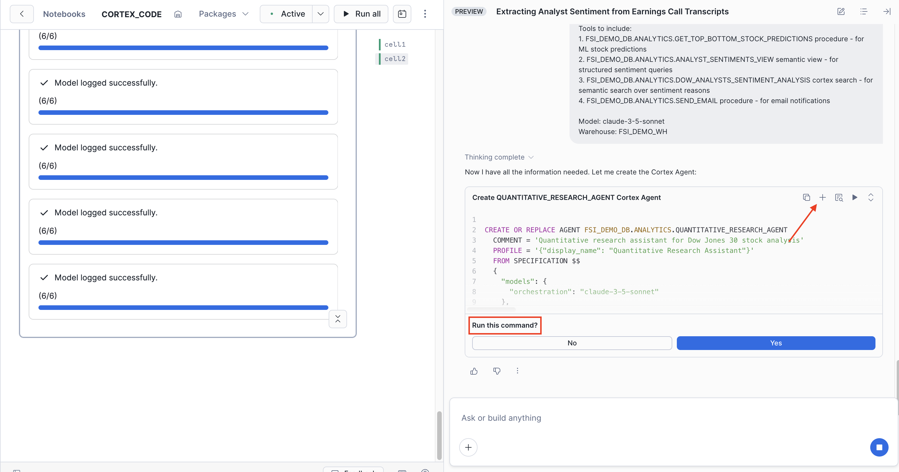

# Quant Research and Data Science with Cortex Code and AI Functions using Snowflake Public Data

Transform unstructured earnings call transcripts into actionable investment insights using Snowflake Cortex AI, ML Model Registry, and intelligent agents - all accelerated by **Cortex Code**.

**Built By:** Harry Yu, Senior Data Scientist, Finance | Snowflake 📧 [h.yu@snowflake.com](mailto:h.yu@snowflake.com) | 💼 [LinkedIn](https://www.linkedin.com/in/haiyue-harry-y-909098179) | 💻 [GitHub](https://github.com/sfc-gh-harryu)

---

## Why This Matters

Financial analysts spend countless hours manually reviewing earnings call transcripts. This guide demonstrates how to **systematically process unstructured data at scale using AI Functions** (`AI_COMPLETE`, `AI_SQL`) - turning raw transcript text into structured sentiment scores, analyst participation metrics, and investment signals that feed directly into quantitative models.

> **Full Guide:** For detailed architecture, business impact, and use cases, see the [Snowflake Developers Guide](https://www.snowflake.com/en/developers/guides/quantitative-research-with-ai-functions-and-cortex-code/).

---

## What You Will Learn
- How to use **Cortex Code** to build entire ML pipelines through natural language
- How to extract structured insights from unstructured text using `AI_COMPLETE()`
- How to train and register ML models in Snowflake's Model Registry
- How to create semantic search over unstructured data with Cortex Search
- How to build a Semantic View for natural language SQL queries via Cortex Analyst
- How to build a Cortex Agent that combines multiple AI tools
- How to access your agent through Snowflake Intelligence

## What You Will Build
- A **sentiment analysis pipeline** using `AI_COMPLETE()` to score earnings call transcripts (1-10 scale)
- A **LightGBM stock prediction model** with walk-forward validation, registered in Snowflake Model Registry
- A **Cortex Search service** for semantic search over sentiment insights
- A **Semantic View** enabling natural language queries via Cortex Analyst
- A **Cortex Agent** that orchestrates ML predictions, structured queries, semantic search, and email notifications—all accessible via Snowflake Intelligence

## Prerequisites

- Snowflake account ([sign up for a free trial](https://signup.snowflake.com/)) with `ACCOUNTADMIN` access (see note below)

> **Note on Privileges:** This guide uses `ACCOUNTADMIN` for simplicity in demo and learning environments. For production deployments, follow the principle of least privilege by creating a dedicated role with only the specific grants required.

## Getting Started

### Step 1: Run Setup Script

1. In Snowsight, navigate to **Projects > Workspaces**
2. Create a new SQL file and copy the contents from [`scripts/setup.sql`](https://github.com/Snowflake-Labs/sfguide-quantitative-research-ai-functions-and-cortex-code/blob/main/scripts/setup.sql)
3. Run the entire script

This creates the complete demo environment including:
- Auto-installs **Snowflake Public Data (Free)** from Marketplace
- Database, warehouse, and role setup
- Pre-computed ML features (`FSI_DATA` table)
- Tables, stored procedures, and ML model infrastructure
- Deploys reference notebooks from this repository

### Step 2: Choose Your Path

| Path | Description |
|------|-------------|
| **[Path A: Cortex Code](#path-a-cortex-code-recommended)** | Build everything through natural language prompts |
| **[Path B: Notebooks](#path-b-notebooks-optional)** | Run pre-built notebooks |

---

## Path A: Cortex Code (Recommended)

Build the entire quantitative research pipeline through conversation with Cortex Code.

### A0: Run Setup Script

Before starting, run the setup script to create the required database objects:

1. Open a SQL worksheet in Snowsight
2. Copy and run the contents of [scripts/setup.sql](https://github.com/Snowflake-Labs/sfguide-quantitative-research-ai-functions-and-cortex-code/blob/main/scripts/setup.sql)

This creates the database, schema, role, warehouse, and base tables needed for the lab.

### A1: Create a New Notebook

1. Navigate to **Projects → Notebooks** in Snowsight
2. Click **+ Notebook** (top-right)
3. Configure the notebook:
   - **Notebook location:** `FSI_DEMO_DB` → `ANALYTICS`
   - **Notebook warehouse:** `FSI_DEMO_WH`
4. Click **Create**
5. Delete the auto-populated sample cells (select cell → delete)
6. Add a Python cell with this starter code and run it:

```python
import pandas as pd
import numpy as np
from snowflake.snowpark.context import get_active_session
session = get_active_session()
session.use_role("FSI_DEMO_ROLE")
session.use_warehouse("FSI_DEMO_WH")
session.use_database("FSI_DEMO_DB")
session.use_schema("ANALYTICS")
```

7. Click **Packages** (top menu) and add:
   - `lightgbm`
   - `scikit-learn`
   - `snowflake-ml-python`
   - `matplotlib`
   - `seaborn`
   - `statsmodels`

8. Click **Start** to activate the notebook

### A2: Open Cortex Code

Click the **Cortex Code icon** (bottom-right corner of the notebook).

> **Tip:** Refresh the page before your first prompt - this helps Cortex Code recognize the notebook context.

### A3: Run Prompts in Sequence

Use the following prompts one at a time. Run the generated code after each prompt before moving to the next.

> **Tip:** You have multiple options to run generated code:
> - Click the **+** button to add it as a new cell in your notebook
> - Use the **Run** option when Cortex Code offers it
> - Click the **play button** to run it within the chat interface

---

#### Prompt 1: AI Sentiment Extraction

```
Using FSI_DEMO_DB.ANALYTICS.UNIQUE_TRANSCRIPTS table, extract analyst sentiment from earnings call transcripts.

Use AI_COMPLETE with claude-4-sonnet to analyze each transcript. Focus ONLY on analyst questions and tone (ignore management remarks). Score sentiment on 1-10 scale where 1=extremely negative, 5=neutral, 10=extremely positive.

Return JSON with: score (1-10), reason (brief explanation), analyst_count (number of unique analysts).

Insert results into AI_TRANSCRIPTS_ANALYSTS_SENTIMENTS table with columns: PRIMARY_TICKER, EVENT_TIMESTAMP, EVENT_TYPE, CREATED_AT, SENTIMENT_SCORE, UNIQUE_ANALYST_COUNT, SENTIMENT_REASON.

Filter out events with analyst_count <= 1.
```


---

#### Prompt 2: Train & Register ML Model

```
Using FSI_DEMO_DB.ANALYTICS.FSI_DATA table which has columns: ticker, date, price, r_1, r_5_1, r_10_5, r_21_10, r_63_21, and y (target).

Train a quarterly walk-forward LightGBM regression model:
- Features: r_1, r_5_1, r_10_5, r_21_10, r_63_21
- Target: y (5-day forward return)
- For each test quarter Q: train on quarters < Q-2, validate on Q-2 and Q-1, test on Q
- Use L2 metric with early stopping (200 rounds patience)
- Hyperparameter grid: learning_rate [0.03, 0.05, 0.10], num_leaves [31, 63]

Register each quarter's best model to Snowflake Model Registry as FIS_{quarter} (e.g., FIS_2024Q3, FIS_2025Q1) with:
- version_name="v1"
- sample_input_data from training data (100 rows)
- options={"relax_version": False, "target_methods": ["predict"], "method_options": {"predict": {"case_sensitive": True}}}

Do NOT pass metrics to log_model. Do NOT use target_methods as a separate parameter.
```



---

#### Prompt 3: Create Cortex Search Service

```
Create a Cortex Search Service named DOW_ANALYSTS_SENTIMENT_ANALYSIS in FSI_DEMO_DB.ANALYTICS schema.

Source table: AI_TRANSCRIPTS_ANALYSTS_SENTIMENTS
Search column: SENTIMENT_REASON
Columns to return: PRIMARY_TICKER, EVENT_TIMESTAMP, SENTIMENT_SCORE, UNIQUE_ANALYST_COUNT, SENTIMENT_REASON
Warehouse: FSI_DEMO_WH
Target lag: 1 day
```



---

#### Prompt 4: Create Semantic View

```
Create a Semantic View named ANALYST_SENTIMENTS_VIEW in FSI_DEMO_DB.ANALYTICS schema for natural language queries on analyst sentiment data.

Source table: AI_TRANSCRIPTS_ANALYSTS_SENTIMENTS

Dimensions:
- PRIMARY_TICKER: Company stock ticker symbol
- EVENT_TIMESTAMP: Date and time of the earnings call
- EVENT_TYPE: Type of event (Earnings Call)

Measures:
- SENTIMENT_SCORE: Analyst sentiment rating from 1-10
- UNIQUE_ANALYST_COUNT: Number of unique analysts participating

Include SENTIMENT_REASON as descriptive text field for qualitative insights.
```



---

#### Prompt 5: Create Agent

```
Create a Cortex Agent named QUANTITATIVE_RESEARCH_AGENT in FSI_DEMO_DB.ANALYTICS schema.

Display name: "Quantitative Research Agent"

Instructions/System prompt:
"You are a quantitative research assistant specializing in Dow Jones 30 stock analysis. You help users with:
1. ML-based stock predictions - Use GET_TOP_BOTTOM_STOCK_PREDICTIONS to get top/bottom ranked stocks by predicted 5-day returns
2. Analyst sentiment queries - Query structured sentiment data (scores, analyst counts) via the semantic view
3. Sentiment insights - Search earnings call transcripts for qualitative analyst commentary
4. Email alerts - Send portfolio recommendations or research summaries via email

When asked about stock picks or predictions, always use the ML prediction tool first. When asked about analyst opinions or sentiment, combine both the semantic view (for scores) and search service (for reasoning). Be concise and data-driven in responses."

Sample questions:
- "What are the top 5 stocks to buy this week based on ML predictions?"
- "Which stocks have the most positive analyst sentiment?"
- "What did analysts say about Apple's last earnings call?"
- "Show me stocks with bullish sentiment but negative ML predictions"
- "Email me a summary of this week's top stock picks"

Tools to include (use SQL CREATE AGENT syntax with tool_resources array):
1. Semantic view tool: type='semantic_view', identifier='FSI_DEMO_DB.ANALYTICS.ANALYST_SENTIMENTS_VIEW'
2. Cortex search tool: type='cortex_search', identifier='FSI_DEMO_DB.ANALYTICS.DOW_ANALYSTS_SENTIMENT_ANALYSIS'
3. Procedure tool (ML predictions): type='procedure', identifier='FSI_DEMO_DB.ANALYTICS.GET_TOP_BOTTOM_STOCK_PREDICTIONS', execution_environment='sandbox'
   - Parameters: MODEL_NAME (STRING, optional - auto-detects latest model if NULL), TOP_N (INTEGER, default 5 - returns both top N and bottom N stocks)
   - Returns ranked stocks by predicted 5-day forward returns
4. Procedure tool (email): type='procedure', identifier='FSI_DEMO_DB.ANALYTICS.SEND_EMAIL', execution_environment='sandbox'
   - Parameters: RECIPIENT_EMAIL (VARCHAR, optional - uses current user's email if NULL), SUBJECT (VARCHAR), BODY (VARCHAR)

IMPORTANT: For procedure tools, you must include execution_environment='sandbox' in the tool_resources.

Model: claude-3-5-sonnet
Warehouse: FSI_DEMO_WH
```



---

#### Prompt 6: Register with Snowflake Intelligence

```
Register the agent FSI_DEMO_DB.ANALYTICS.QUANTITATIVE_RESEARCH_AGENT with Snowflake Intelligence object SNOWFLAKE_INTELLIGENCE_OBJECT_DEFAULT so users can interact with it conversationally.
```

---

### A3: Test the Agent

Navigate to **AI & ML → Snowflake Intelligence** and select **Quantitative Research Agent**. Try these:

**ML Predictions:**
```
Give me top 3 vs bottom 3 trade predictions for the next period
```

**Sentiment Queries:**
```
Which companies have the highest sentiment score?
```

**Semantic Search:**
```
Search for companies with concerns about margins
```

**Combined Analysis:**
```
Compare the top predicted stocks with their analyst sentiment scores
```

**Email Reports:**
> **Note:** Email functionality requires your Snowflake user to have a verified email address. Verify your email in Snowsight: User menu → Setting → Profile → Verify Email.

```
Send me an email summary of today's top stock picks
```

---

### Optional Prompts (Learning/Understanding)

These prompts are for deeper exploration - not required for the agent.

<details>
<summary><b>Optional Prompt A: Feature Engineering (from scratch)</b></summary>

> **Note:** This is already done in `setup.sql` which creates the `FSI_DATA` table with pre-computed features. Use this prompt if you want to understand or recreate the feature engineering process.

```
Using SNOWFLAKE_PUBLIC_DATA_FREE.PUBLIC_DATA_FREE.STOCK_PRICE_TIMESERIES for Dow Jones 30 stocks (MMM, AXP, AMGN, AMZN, AAPL, BA, CAT, CVX, CSCO, KO, DIS, GS, HD, HON, IBM, JNJ, JPM, MCD, MRK, MSFT, NKE, PG, RTX, CRM, SHW, TRV, UNH, V, WMT, NVDA).

Construct momentum features using log returns:
- r_1: today's return
- r_5_1: return from t-4 to t-1
- r_10_5: return from t-9 to t-5
- r_21_10: return from t-20 to t-11
- r_63_21: return from t-62 to t-21

Construct target variable y: future return from t+2 to t+6.

Keep as panel data with ticker as a column.
```
</details>

<details>
<summary><b>Optional Prompt B: Backtesting Strategy</b></summary>

```
Test if the ML strategy works starting 2021.

Portfolio construction:
- Generate forecasts on Tuesdays
- At Wednesday close, go long top-5 and short bottom-5 by predicted return (equal weight)
- Hold through Thursday to next Wednesday (the t+2..t+6 window)
- Transaction cost: 3.0 bps one-way via weekly turnover

Show metrics:
- Information Ratio (before/after costs)
- Max drawdown
- Calmar ratio

Plot equity curves for before and after costs.
```
</details>

<details>
<summary><b>Optional Prompt C: Sentiment-Return Regression Analysis</b></summary>

```
Analyze the relationship between analyst sentiment and stock returns.

Merge sentiment data with price data using merge_asof (forward direction).

Create:
- 1D return: reaction during earnings call
- 3D return: return_lead_1 + return_lead_2 + return_lead_3 (post-earnings drift)

Run OLS regression: return ~ sentiment_score
Winsorize returns at 1st/99th percentiles.

Create scatter plots showing:
- Sentiment Score vs 1D Return with OLS fit line, β, t-stat
- Sentiment Score vs 3D Return with OLS fit line, β, t-stat

Repeat analysis using sentiment_change (vs previous earnings call).
```
</details>

---

## Path B: Notebooks (Optional)

If you prefer running pre-built code instead of Cortex Code prompts:

### B1: Run START_HERE Notebook
1. Navigate to **Projects > Notebooks**
2. Switch role to `FSI_DEMO_ROLE`
3. Open `START_HERE` notebook
4. Run all cells to extract analyst sentiment using AI Functions

*Equivalent to Prompt 1*

### B2: Run TRAIN_ML_MODELS Notebook
1. Open `TRAIN_ML_MODELS` notebook
2. Run all cells to train and register ML models

*Equivalent to Prompt 2*

### B3: Run CREATE_CORTEX_COMPONENTS Notebook
1. Open `CREATE_CORTEX_COMPONENTS` notebook
2. Run all cells to create Cortex Search, Semantic View, and Agent

*Equivalent to Prompts 3-6*

### B4: Test the Agent
Navigate to **AI & ML → Snowflake Intelligence** and select **Quantitative Research Agent**.

---

## Cortex Code Power Moves

Beyond the guided prompts, here's what Cortex Code can do:

### Explore & Understand
```
What tables exist in FSI_DEMO_DB.ANALYTICS? Describe each one.
```
```
Explain this notebook cell by cell
```

### Debug & Fix
```
This cell is throwing an error - help me fix it
```
```
Why is my model prediction returning NULL?
```

### Analyze Results
```
Summarize the model's feature importance
```
```
Which stocks had the biggest prediction errors?
```

---

## Cleanup

To remove all demo objects:

1. Navigate to **Projects > Workspaces**
2. Create a new SQL file with contents from [`scripts/teardown.sql`](https://github.com/Snowflake-Labs/sfguide-quantitative-research-ai-functions-and-cortex-code/blob/main/scripts/teardown.sql)
3. Run the script

---

## What's Next?

You've built an end-to-end AI-powered quantitative research pipeline entirely within Snowflake. From here:

- **Expand coverage** - Add more companies beyond DOW 30
- **Add new features** - Use Cortex Code to add technical indicators (RSI, MACD)
- **Improve the model** - Experiment with different algorithms
- **Build dashboards** - Create a Streamlit app for visualization
- **Automate updates** - Schedule daily predictions with Snowflake Tasks

Use **Cortex Code** to help with all of it—just describe what you want to build.

---

## Resources

- [Cortex Code Documentation](https://docs.snowflake.com/en/user-guide/cortex-code/cortex-code)
- [Cortex AI Functions](https://docs.snowflake.com/en/user-guide/snowflake-cortex/aisql)
- [Cortex Search](https://docs.snowflake.com/en/user-guide/snowflake-cortex/cortex-search/cortex-search-overview)
- [Cortex Analyst](https://docs.snowflake.com/en/user-guide/snowflake-cortex/cortex-analyst)
- [Snowflake Intelligence](https://docs.snowflake.com/en/user-guide/snowflake-intelligence/overview)
- [Snowflake ML Model Registry](https://docs.snowflake.com/en/developer-guide/snowflake-ml/model-registry/overview)
- [Snowflake Notebooks](https://docs.snowflake.com/en/user-guide/ui-snowsight/notebooks)

## License

Copyright (c) Snowflake Inc. All rights reserved.

The code in this repository is licensed under the Apache 2.0 License.
