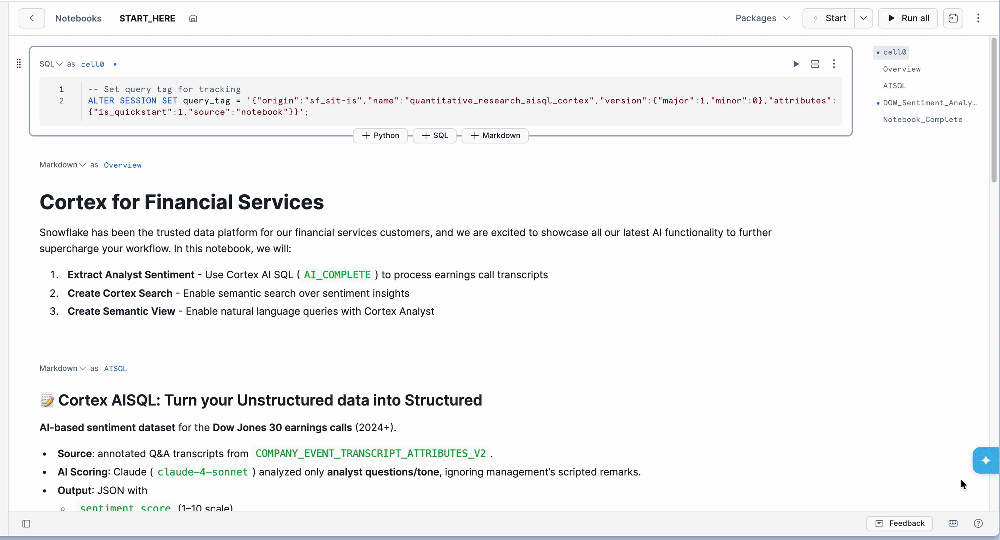
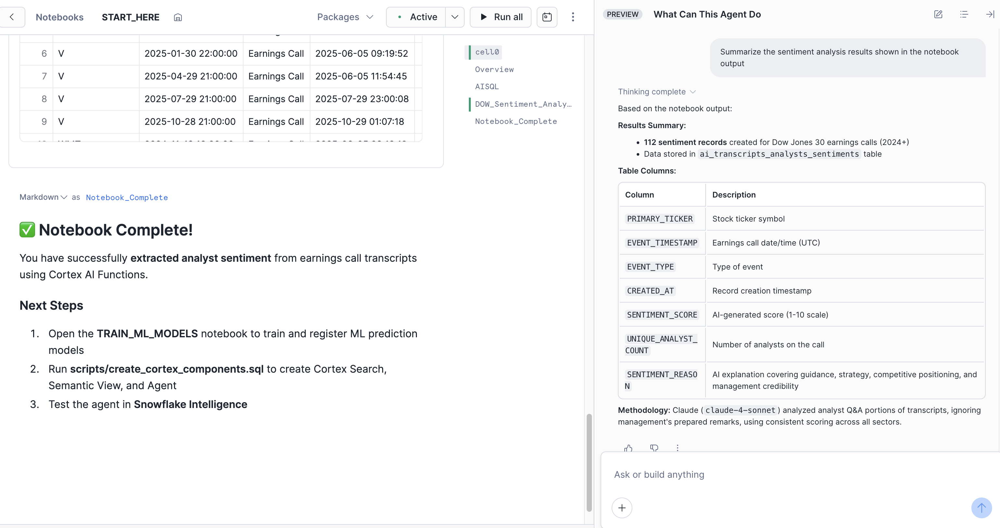
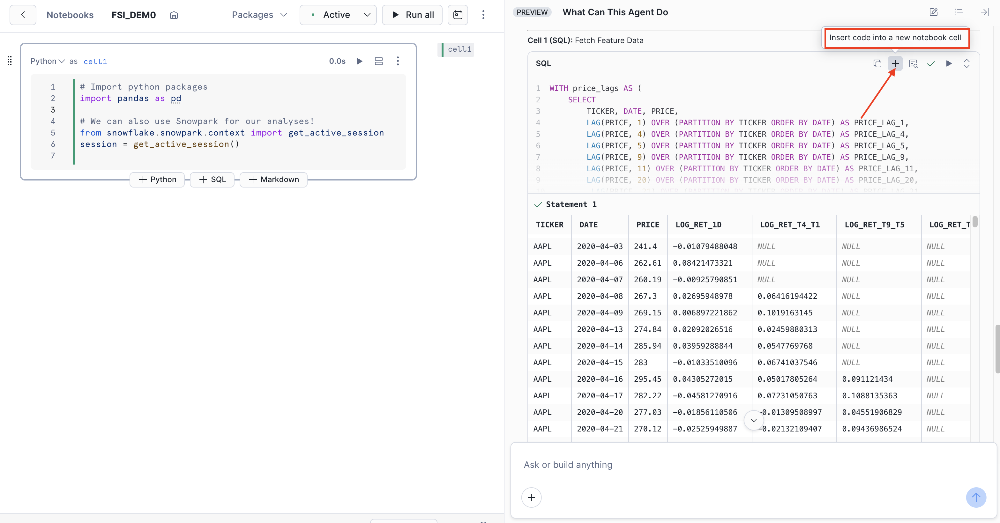
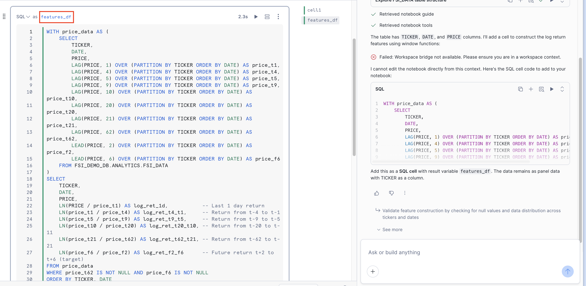
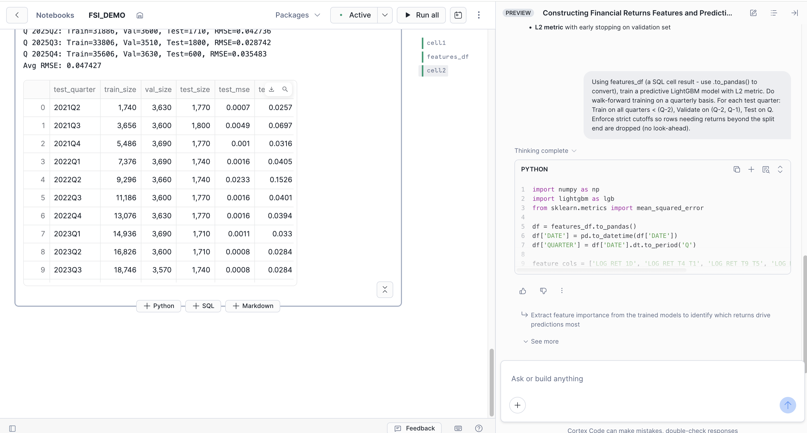
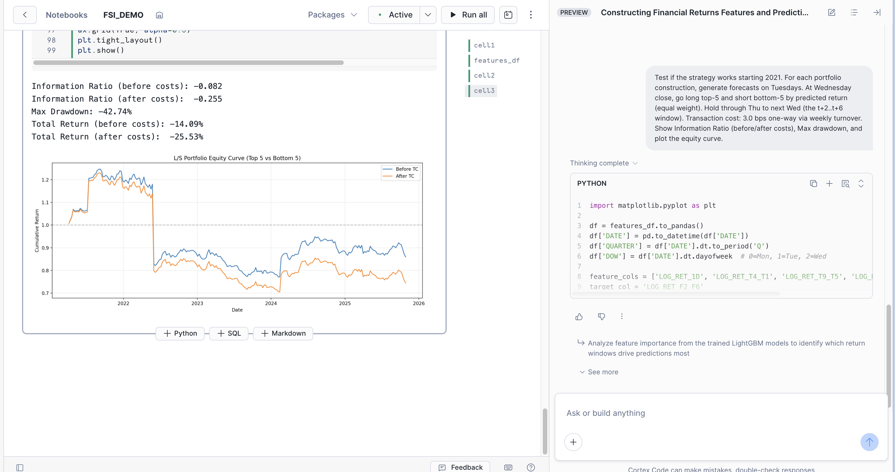
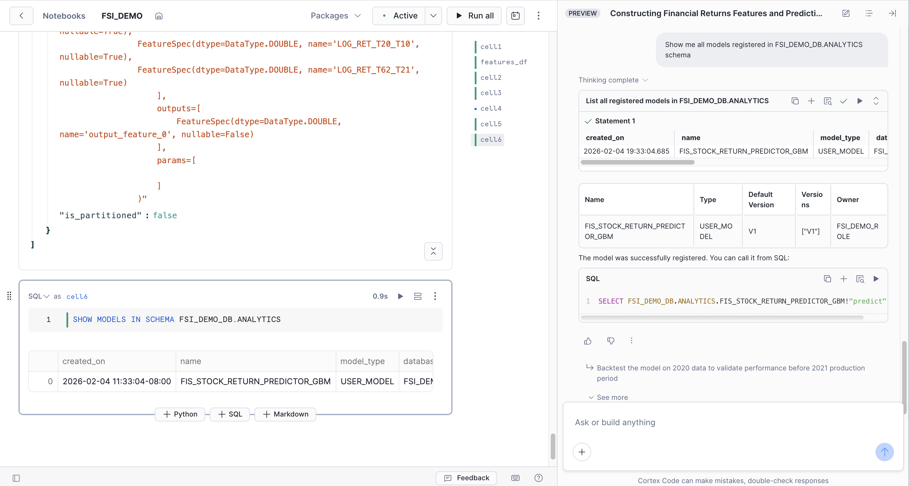

# Quantitative Research with Cortex Code and AI Functions using Snowflake Public Data

Transform unstructured earnings call transcripts into actionable investment insights using Snowflake Cortex AI, ML Model Registry, and intelligent agents - all accelerated by **Cortex Code**.

## Why This Matters

Financial analysts spend countless hours manually reviewing earnings call transcripts. This guide demonstrates how to **systematically process unstructured data at scale using AI Functions** (`AI_COMPLETE`, `AI_SQL`) - turning raw transcript text into structured sentiment scores, analyst participation metrics, and investment signals that feed directly into quantitative models.

> **Full Guide:** For detailed architecture, business impact, and use cases, see the [Snowflake Developers Guide]().

## What You Will Learn
- How to use **Cortex Code** to build data pipelines through natural language
- How to extract structured insights from unstructured text using `AI_COMPLETE()`
- How to train and register ML models in Snowflake's Model Registry
- How to create semantic search over unstructured data with Cortex Search
- How to build a Cortex Agent that combines multiple AI tools

## What You Will Build
- A sentiment analysis pipeline that scores earnings call transcripts (1-10 scale)
- A LightGBM stock return prediction model with walk-forward validation
- A Cortex Search service for natural language queries over sentiment data
- A Cortex Agent accessible via Snowflake Intelligence

## Prerequisites

- Snowflake account ([sign up for a free trial](https://signup.snowflake.com/)) with `ACCOUNTADMIN` access (see note below)
- Access to [Snowflake Marketplace](https://app.snowflake.com/marketplace)

> **Note on Privileges:** This guide uses `ACCOUNTADMIN` for simplicity in demo and learning environments. For production deployments, follow the principle of least privilege by creating a dedicated role with only the specific grants required.

## Getting Started

### Step 1: Get Marketplace Data

1. Navigate to [Snowflake Public Data (Free)](https://app.snowflake.com/marketplace/listing/GZTSZ290BV255/snowflake-public-data-products-snowflake-public-data-free) in Snowflake Marketplace
2. Click **Get** and accept the terms
3. Keep the default database name `SNOWFLAKE_PUBLIC_DATA_FREE`
4. Grant access to `ACCOUNTADMIN` role
5. Click **Get** to install

### Step 2: Run Setup Script

1. In Snowsight, navigate to **Projects > Workspaces**
2. Create a new SQL file and copy the contents from [`scripts/setup.sql`](https://github.com/Snowflake-Labs/sfguide-quantitative-research-ai-functions-and-cortex-code/blob/main/scripts/setup.sql)
3. Run the entire script

This creates the complete demo environment including database, warehouse, tables, stored procedures, and deploys notebooks from this repository.

### Step 3: Run Notebook - Start Here

1. In Snowsight, navigate to **Projects > Notebooks**
2. Switch your role to `FSI_DEMO_ROLE` (bottom-left, click on your username)
3. Open the `START_HERE` notebook
4. Run all cells to extract analyst sentiment from earnings call transcripts using Cortex AI Functions

> **Try with Cortex Code (before running cells):**
> ```
> Explain what the AI_COMPLETE function does in this notebook
> ```



> **After running all cells:**
> ```
> Summarize the sentiment analysis results shown in the notebook output
> ```



### Step 4: Build ML Pipeline with Cortex Code

This is where **Cortex Code shines** - build an entire ML pipeline through conversation.

> **Note:** To use Snowflake Intelligence in Step 6, you must complete either Option A or Option B to register an ML model.

**Option A: Run pre-built code**
1. Open the `TRAIN_ML_MODELS` notebook and run all cells

**Option B: Build it yourself with Cortex Code**
1. Create a **new blank notebook** with these settings:
   - **Notebook location:** `FSI_DEMO_DB` / `ANALYTICS`
   - **Runtime:** Run on warehouse
   - **Query warehouse:** `FSI_DEMO_WH`
   - **Notebook warehouse:** `FSI_DEMO_WH`
2. Install required packages using the **Packages** selector (top of the page):
   - `lightgbm`
   - `scikit-learn`
   - `matplotlib`
   - `seaborn`
   - `statsmodels`
   - `snowflake-ml-python`
3. Add a Python cell with the following imports and run it:
```python
# Import python packages
import pandas as pd

# We can also use Snowpark for our analyses!
from snowflake.snowpark.context import get_active_session
session = get_active_session()
```
4. Open **Cortex Code** (bottom-right icon)
5. Use these prompts **one at a time**, running the generated code after each:

<!-- IMAGE: GIF or screenshot showing typing a prompt and code being generated -->

> **Note:** You can start with Prompt 1 immediately - Cortex Code will explore the FSI_DATA table directly.

**Prompt 1: Feature Engineering**
```
Using FSI_DEMO_DB.ANALYTICS.FSI_DATA table, help me construct features with returns: the last 1 day return using close price, return from t-4 to t-1, return from t-9 to t-5, return from t-20 to t-11, and return from t-62 to t-21. Also construct the predictive variable as future return from t+2 to t+6. Take the log across all return variables. Keep as panel data where ticker is a column.
```



> **After Cortex Code generates the code:** 
> 1. Copy the SQL into a new **SQL cell**
> 2. Click on the cell name (e.g., `cell2`) in the top-left corner and rename it to `features_df`
> 3. Run the SQL cell
>
> 


**Prompt 2: Train ML Model**
```
Using features_df (a SQL cell result - use .to_pandas() to convert), train a predictive LightGBM model with L2 metric. Do walk-forward training on a quarterly basis. For each test quarter: Train on all quarters < (Q-2), Validate on (Q-2, Q-1), Test on Q. Enforce strict cutoffs so rows needing returns beyond the split end are dropped (no look-ahead).
```



**Prompt 3: Backtesting**
```
Test if the strategy works starting 2021. For each portfolio construction, generate forecasts on Tuesdays. At Wednesday close, go long top-5 and short bottom-5 by predicted return (equal weight). Hold through Thu to next Wed (the t+2..t+6 window). Transaction cost: 3.0 bps one-way via weekly turnover. Show Information Ratio (before/after costs), Max drawdown, and plot the equity curve.
```



**Prompt 4: Register Model in Snowflake**
```
Register the final model in Snowflake Registry with model name "FIS_STOCK_RETURN_PREDICTOR_GBM", sample input of 100 rows, target_platforms=["WAREHOUSE"], and method_options for predict with case_sensitive=True.
```

**Prompt 5: Verify Model Registration**
```
Show me all models registered in FSI_DEMO_DB.ANALYTICS schema
```



> **Explore the code further:**
> ```
> Explain how the walk-forward validation prevents look-ahead bias
> ```
> ```
> Compare model performance across different feature combinations to identify which return windows matter most
> ```
> ```
> Why might the model be overfitting? Suggest fixes
> ```

### Step 5: Run Notebook - Create Cortex Components

1. In Snowsight, navigate to **Projects > Notebooks**
2. Open the `CREATE_CORTEX_COMPONENTS` notebook
3. Run all cells to create Cortex Search, Semantic View, and the Agent

### Step 6: Test the Agent

Navigate to **AI & ML → Snowflake Intelligence** and try these example questions:


**ML Predictions (StockPerformancePredictor):**
```
Give me top 3 vs bottom 3 trade predictions for the next period
```
```
What are the model's top stock picks right now?
```
```
Show me the bottom 5 predicted performers
```

**Structured Data Queries (Cortex Analyst):**
```
Which companies have the highest sentiment score?
```
```
What is the average sentiment score by company?
```
```
Show me sentiment trends over time for MSFT
```

**Semantic Search (Cortex Search):**
```
Search for companies with concerns about margins
```
```
Find earnings calls where analysts discussed supply chain issues
```
```
Search for bullish commentary about revenue growth
```

**Combined Analysis:**
```
Compare the top predicted stocks with their analyst sentiment scores
```
```
Let's observe if any high sentiment in the bottom 3 performers, and summarize the qualitative insights from the earnings call that shows top sentiment
```
```
Show me the top 5 predictions and search for any negative sentiment in their earnings calls
```

**Email Reports (SendEmail):**

> **Note:** Email functionality requires your Snowflake user to have a verified email address. Verify your email in Snowsight: User menu → Setting → Profile → Verfify Email.

```
Send me an email summary of today's top stock picks
```
```
Email me a report of companies with sentiment scores above 8
```
```
Send an email with the top 3 vs bottom 3 predictions
```

## Cortex Code Power Moves

Beyond following the guided steps, here's what Cortex Code can do:

### Explore & Understand
```
What tables exist in FSI_DEMO_DB.ANALYTICS? Describe each one.
```
```
Explain this notebook cell by cell
```
```
What's the schema of the AI_TRANSCRIPTS_ANALYSTS_SENTIMENTS table?
```

### Debug & Fix
```
This cell is throwing an error - help me fix it
```
```
Why is my model prediction returning NULL?
```
```
The query is slow - how can I optimize it?
```

### Analyze Results
```
Summarize the model's feature importance
```
```
Compare actual vs predicted returns for Q4
```
```
Which stocks had the biggest prediction errors?
```

## Cleanup

To remove all demo objects, run the teardown script:

1. In Snowsight, navigate to **Projects > Workspaces**
2. Create a new SQL file and copy the contents from [`scripts/teardown.sql`](https://github.com/Snowflake-Labs/sfguide-quantitative-research-ai-functions-and-cortex-code/blob/main/scripts/teardown.sql)
3. Run the script

## What's Next?

You've built an end-to-end AI-powered quantitative research pipeline entirely within Snowflake. From here, you can:

- **Expand coverage** - Add more companies beyond the DOW 30
- **Add new features** - Use Cortex Code to add technical indicators (RSI, MACD, Bollinger Bands)
- **Improve the model** - Experiment with different ML algorithms or hyperparameters
- **Build dashboards** - Create a Streamlit app to visualize sentiment trends
- **Automate updates** - Schedule daily predictions with Snowflake Tasks

The best part? You can use **Cortex Code** to help with all of it—just describe what you want to build.

## Resources

- [Cortex Code Documentation](https://docs.snowflake.com/en/user-guide/cortex-code/cortex-code)
- [Cortex AI Functions](https://docs.snowflake.com/en/user-guide/snowflake-cortex/aisql)
- [Cortex Search](https://docs.snowflake.com/en/user-guide/snowflake-cortex/cortex-search/cortex-search-overview)
- [Cortex Analyst](https://docs.snowflake.com/en/user-guide/snowflake-cortex/cortex-analyst)
- [Snowflake Intelligence](https://docs.snowflake.com/en/user-guide/snowflake-intelligence/overview)
- [Snowflake ML Model Registry](https://docs.snowflake.com/en/developer-guide/snowflake-ml/model-registry/overview)
- [Snowflake Notebooks](https://docs.snowflake.com/en/user-guide/ui-snowsight/notebooks)

## License

Copyright (c) Snowflake Inc. All rights reserved.

The code in this repository is licensed under the Apache 2.0 License.
